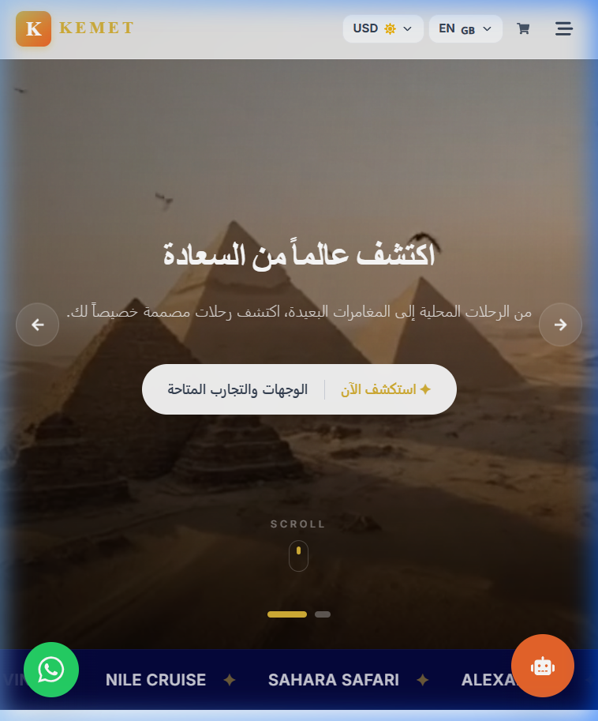
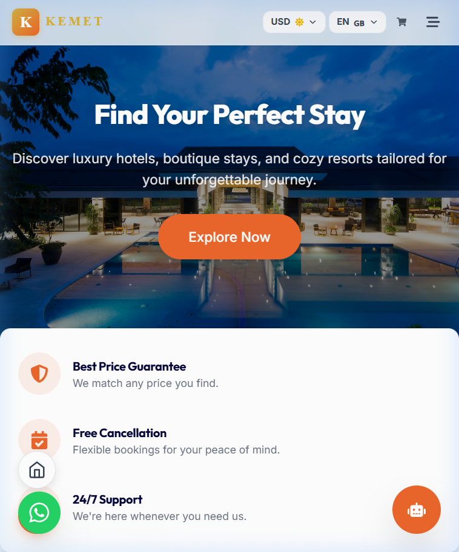
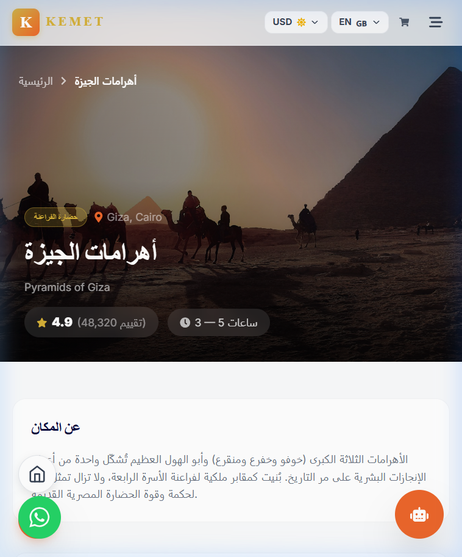

# 🏨 Booking App

A modern **Booking / Explore Activities** web application built with **React + TypeScript**.  
The project focuses on clean UI, simple business logic, and scalable structure suitable for real-world applications.

---

## ✨ Features

- Browse available activities
- Filter activities by category
- Highlight best seller activities
- Sort activities by:
  - Recommended
  - Price (Low to High)
  - Price (High to Low)
  - Rating
- Pagination
- Responsive layout
- Clean and reusable components

---

## 🛠️ Tech Stack

- **React**
- **TypeScript**
- **React Router**
- **Tailwind CSS**
- **React Icons**
- **Vite**

---

## 📸 Screenshots

### Homepage

### Hotels Page

### Attraction Details

